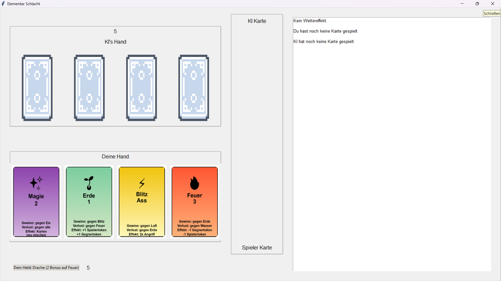
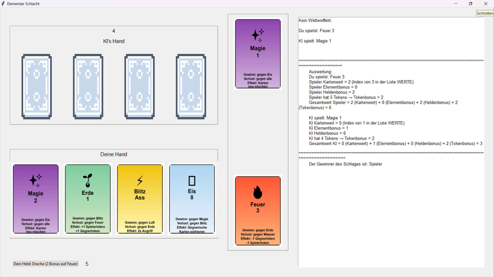
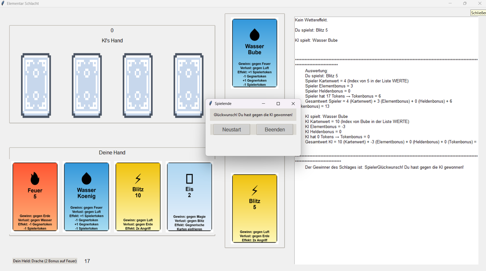

# Elementar Schlacht - Kartenspiel

## Übersicht

**Elementar Schlacht** ist ein strategisches Kartenspiel, das mithilfe von Python entwickelt wurde. Es bietet eine interaktive grafische Benutzeroberfläche (GUI), bei der der Spieler gegen eine KI antreten kann. Die Karten sind nach Elementen kategorisiert (z. B. Feuer, Wasser, Erde) und bieten unterschiedliche Werte sowie Boni.

Das Projekt wurde modular aufgebaut, um eine klare Struktur zu gewährleisten. Es umfasst sowohl Spielmechaniken als auch grafische Darstellungen sowie ein neuronales Netzwerk zur Analyse von Spielausgängen.

---

## Inhaltsverzeichnis

1. [Features](#features)
2. [Installation](#installation)
3. [Verwendung](#verwendung)
4. [Projektstruktur](#projektstruktur)
5. [Technische Details](#technische-details)
6. [Screenshots](#screenshots)
7. [Credits](#credits)

---

## Features

- **Grafische Benutzeroberfläche (GUI):** Intuitive Bedienung des Spiels über eine interaktive Oberfläche.
- **Kartenmechanik:** Verschiedene Elemente und Kartenwerte beeinflussen das Spiel.
- **KI-Gegner:** Automatische Gegnerlogik, die Entscheidungen basierend auf den Karten trifft.
- **Wettereffekte:** Zufällige Modifikatoren, die die Spielmechanik beeinflussen.
- **Simulationen und Modellierung:** Einsatz eines neuronalen Netzwerks zur Analyse und Vorhersage von Spielausgängen.
- **Hyperparameter-Optimierung:** Optionales Tuning des Modells zur Steigerung der Genauigkeit.

---

## Installation

### Voraussetzungen

- Python 3.12 oder höher
- Die folgenden Python-Bibliotheken müssen installiert sein:
  - `tkinter`
  - `Pillow`
  - `pandas`
  - `numpy`
  - `scikit-learn`
  - `tensorflow`
  - `matplotlib`

### Schritte

1. **Repository klonen oder herunterladen:**
   ```bash
   git clone https://github.com/kruemmel-python/ai-elementar-strategy-cardgame/elementar-schlacht.git
   ```

2. **In das Projektverzeichnis wechseln:**
   ```bash
   cd elementar-schlacht
   ```

3. **Abhängigkeiten installieren:**
   ```bash
   pip install -r requirements.txt
   ```

4. **Spiel starten:**
   ```bash
   python gui.py
   ```

---

## Verwendung

1. **Spiel starten:** Führen Sie die Datei `gui.py` aus, um die grafische Benutzeroberfläche zu öffnen.
2. **Karten auswählen:** Wählen Sie Karten aus Ihrer Hand und spielen Sie gegen die KI.
3. **Strategie:** Nutzen Sie die Boni Ihrer Helden und die Elemente der Karten.
4. **Neuronales Netzwerk trainieren (optional):** Führen Sie `spiel.py` aus, um das Modell zu trainieren und Simulationen durchzuführen.
5. **Spiel beenden:** Das Spiel endet, wenn ein Spieler keine Karten mehr hat oder alle Runden abgeschlossen sind.

---

## Projektstruktur

```
.
├── gui.py                 # Hauptdatei für die grafische Oberfläche
├── spiel.py               # Spielmechanik und neuronales Netzwerk
├── konstanten.py          # Definiert Konfigurationswerte wie Kartenpfade
├── create_cards.py        # Logik zur Erstellung von Karten
├── Simulationen/          # Daten und Modelle für Simulationen
│   ├── spieldaten.csv     # CSV-Datei mit Simulationsdaten
│   ├── elementar_schlacht_modell.keras # Gespeichertes Modell
├── PNG/Cards/             # Ressourcen für Kartenbilder
└── README.md              # Dokumentation
```

---

## Technische Details

### Neuronales Netzwerk

- **Struktur:**
  - Zwei vollständig verbundene Schichten (Dense) mit `ReLU`-Aktivierung.
  - Eine Dropout-Schicht zur Regularisierung.
  - Eine Ausgabeschicht mit `softmax`-Aktivierung zur Klassifikation.

- **Optimierung:**
  - Verlustfunktion: `sparse_categorical_crossentropy`
  - Optimierer: `Adam` mit einstellbarer Lernrate.

- **Trainingsmetriken:**
  - Genauigkeit und Verlust werden über Epochen verfolgt.

- **Optionale Hyperparameter-Optimierung:**
  - Nutzung von `GridSearchCV`, um Parameter wie Dropout-Raten und Neuronenzahlen zu optimieren.

### Datenvorverarbeitung

- **Kodierungen:**
  - Label-Encoding für Elemente und Werte.
  - One-Hot-Encoding für Wetterbedingungen und Helden.

- **Trainings- und Testaufteilung:**
  - Verwendet `train_test_split` mit einem Testdatenanteil von 20%.

### Visualisierung

- Trainingshistorie wird mit `matplotlib` geplottet.

---

## Screenshots

### Hauptmenü


### Spielerhand


### Spielstatus


---

## Credits

- **Entwicklung:** Ralf Krümmel
- **Ressourcen:** Kartenbilder durch create_cars.py erstellt

---

Vielen Dank, dass Sie **Elementar Schlacht** ausprobieren! Viel Spaß beim Spielen.

